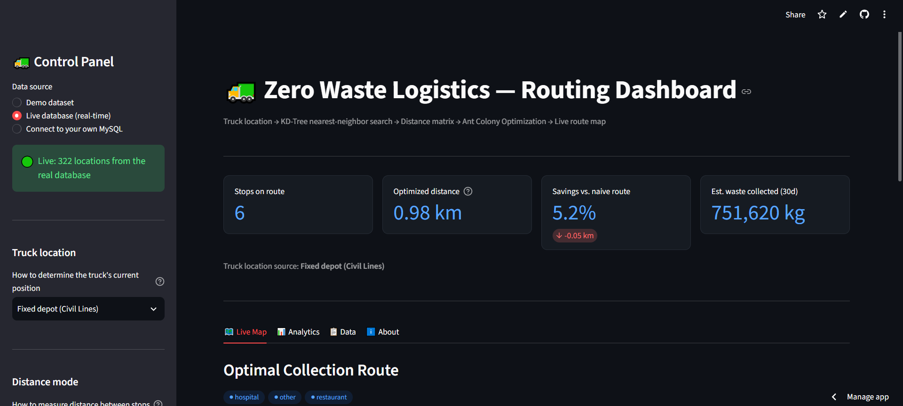
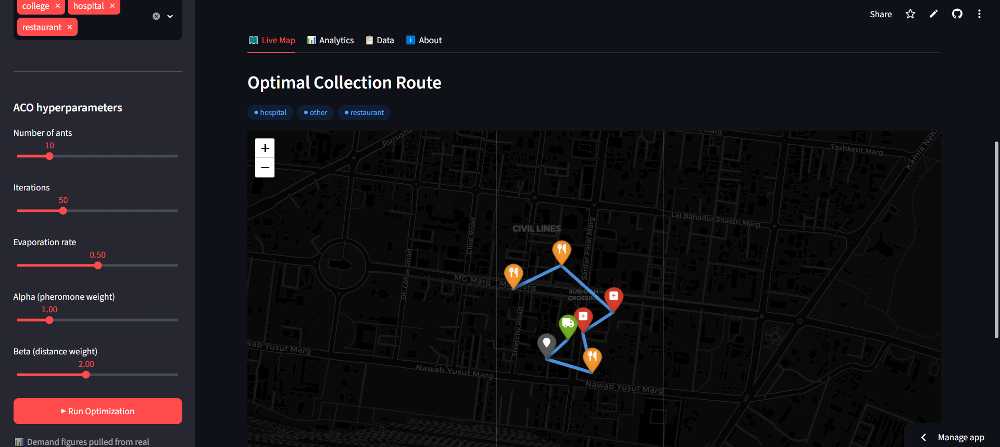

<div align="center">

# 🚛 Zero Waste Logistics — Smart Waste Collection Routing

</div>


An end-to-end route optimization system that finds **near-optimal garbage collection routes** across a city using **real road-network distances** (not straight-line estimates) and an **Ant Colony Optimization** algorithm built from scratch — going beyond a fixed daily route into something that actually adapts to where the truck is and what's on the map. It also connects, in real time, to a live cloud-hosted database rather than only running on bundled demo data.

**Business Impact:** Cut total route distance by roughly **5–20%** versus a naive nearest-neighbor ordering (varies by run/hyperparameters), while switching the underlying distance calculation from straight-line estimates to **real drivable road distances** via Dijkstra's shortest-path algorithm — meaning the optimized route is one a truck could actually drive, not just a theoretical shortcut through buildings.

🔗 **Live Demo:** [https://zero-waste-logistics.streamlit.app](https://zero-waste-logistics.streamlit.app)

---
<div align="center">





</div>

---

## 🎯 Problem Statement

Waste collection trucks in most cities run the same fixed route every single day, regardless of which locations actually have waste piling up, and regardless of whether that route is even close to optimal. There's no dynamic response to real demand, and no consideration of actual road distance versus a straight-line guess — leading to wasted fuel, wasted time, and inefficient service.

## 💡 Solution

Zero Waste Logistics builds a small end-to-end system that:
- pulls real pickup-location data for a city from OpenStreetMap
- figures out which locations are closest to the truck's *current* position (not a fixed daily list)
- calculates the shortest route using **real road distances** the truck can actually drive, not a straight line through buildings
- optimizes the order of stops with an **Ant Colony Optimization** algorithm instead of a naive nearest-first ordering
- connects live to a real, cloud-hosted database rather than only running on mock data
- presents all of this in a live, interactive dashboard anyone can explore

---

## 🧠 What's Under the Hood

| Stage | What Happens | Tech |
|---|---|---|
| 🗺️ Data Extraction | Restaurants, hospitals & colleges pulled from OpenStreetMap | `osmnx` |
| 🗄️ Storage | Location + historical demand data persisted to a MySQL database, hosted live in the cloud | `MySQL` (Aiven) |
| 🎲 Demand Data | **Real** aggregated pickup history when connected live; synthetic patterns as a fallback for the offline demo dataset | `SQL` / `NumPy` |
| 📍 Nearest-Neighbor Search | Instantly finds the closest pending pickups to the truck | `SciPy KD-Tree` |
| 🛣️ Real Road Distance | Locations snapped onto the actual drivable street graph, shortest paths computed with **Dijkstra's algorithm** | `NetworkX` + `osmnx` |
| 🐜 Route Optimization | Ant Colony Optimization, built from scratch — pheromone trails + distance heuristics converge on a short route | Custom Python |
| 📊 Live Dashboard | Interactive map, KPIs, and optimizer convergence charts | `Streamlit` + `Folium` + `Plotly` |

---

## ✨ Features

- 🚚 **Dynamic truck location** — simulated in real time, or pulled live from GPS telemetry, never hardcoded
- 🔌 **Live production database** — connects in real time to a cloud-hosted MySQL instance (Aiven), pulling actual location and demand-history data — not a mock or a local-only demo
- 📊 **Real demand analytics** — when connected live, waste-volume and request-count KPIs are computed from an actual stored `historical_requests` table via SQL aggregation, not regenerated randomly on each run
- 🛰️ **Two distance modes** — instant straight-line estimate, or real road-network driving distance (Dijkstra on the actual street graph)
- 🐜 **Tunable ACO engine** — adjust ants, iterations, evaporation rate, and pheromone/distance weighting live from the sidebar
- 🗺️ **Live interactive map** — optimized route rendered stop-by-stop with amenity-specific markers
- 📈 **Optimizer analytics** — convergence curve + naive-route vs. optimized-route comparison
- 🔐 **Secrets-based auth** — live database credentials are never typed by a visitor or stored in the repo, managed entirely through Streamlit's Secrets manager
- 🛡️ **Resilient by design** — gracefully falls back to demo data if a live DB connection isn't available, instead of crashing
- ⏰ **Always-on demo** — a scheduled GitHub Actions workflow keeps the deployed app pinged and awake, so it's never asleep when someone clicks the link

---

## 🏗️ Pipeline

```
OpenStreetMap ──▶ MySQL (Aiven, cloud-hosted) ──▶ KD-Tree (nearest pickups)
                                    │
                                    ▼
                  Road Network Graph + Dijkstra (real distances)
                                    │
                                    ▼
                      Ant Colony Optimization (best route)
                                    │
                                    ▼
                         Streamlit Live Dashboard
```

---

## 🎓 What This Project Demonstrates

- **Graph algorithms** — Dijkstra's shortest-path algorithm applied to a real 48,000+ node city road network, not a toy graph
- **Spatial data structures** — KD-Trees for fast geographic nearest-neighbor lookup
- **Combinatorial optimization** — Ant Colony Optimization implemented from first principles (not a library call), including pheromone evaporation/deposit and the alpha/beta exploration-vs-exploitation tradeoff
- **Real-world geospatial engineering** — the jump from naive straight-line distance to actual road-network shortest paths, which is the difference between a toy demo and something realistic
- **Live data engineering** — a real cloud-hosted MySQL database (Aiven), SSL-secured connections, and SQL aggregation queries against actual stored history, not just a schema that sits unused
- **Secrets management** — credentials handled via Streamlit's Secrets manager rather than hardcoded or typed by end users, with a documented rotation after an earlier accidental commit (see note below)
- **Production-minded habits** — no hardcoded "truck location," graceful fallbacks instead of crashes, connection timeouts instead of indefinite hangs
- **Full-stack deployment** — from a Jupyter notebook prototype to a live, publicly deployed app on Streamlit Community Cloud, version-controlled on GitHub, with a scheduled uptime workflow

---

## 🚀 Run It Yourself

```bash
git clone https://github.com/Amrit706/zero-waste-logistics.git
cd zero-waste-logistics
pip install -r requirements.txt
streamlit run app.py
```

Runs instantly on the bundled demo dataset — no database setup required. The sidebar offers three data sources:
- **Demo dataset** — works immediately, no setup
- **Live database (real-time)** — connects automatically using credentials from Streamlit Secrets (only available if you've configured your own `.streamlit/secrets.toml`)
- **Connect to your own MySQL** — point it at any MySQL database with a matching schema

---

## 📁 Project Structure

```
zero-waste-logistics/
├── app.py                          # Streamlit dashboard
├── main_updated.ipynb              # Full pipeline, built & tested step by step
├── requirements.txt                # Dependencies
├── prayagraj_drive_network.graphml # Cached road network (instant load, no re-download)
├── .github/workflows/keep_awake.yml# Scheduled ping to keep the deployed app awake
├── .streamlit/secrets.toml         # Local-only DB credentials (gitignored, never committed)
└── README.md
```

---

## 🛠️ Tech Stack


**OSMnx** · **NetworkX** (Dijkstra's algorithm) · **Folium** · **Aiven** (managed cloud MySQL) · **Ant Colony Optimization** (custom implementation)

---

## 📌 Notes on the Data

- **Location data** (restaurants, hospitals, colleges) is real, pulled live from OpenStreetMap.
- **Demand data** is real when connected via "Live database (real-time)" — it's aggregated with a SQL query against an actual `historical_requests` table. The **Demo dataset** mode, by contrast, generates synthetic demand patterns on the fly (since the demo locations have no matching real request history), using realistic assumptions (e.g. hospitals get picked up more frequently than colleges, restaurants spike during dinner hours).
- **Limitations:** the free-tier cloud database (1 GB RAM/storage) may briefly pause after periods of inactivity, adding a few seconds to the first live-database connection. A scheduled GitHub Actions workflow keeps the Streamlit app itself awake, though it does not separately ping the database.

---

<div align="center">

⭐ **If this project is useful or interesting to you, consider starring the repo!**

🔗 **[View the live app](https://zero-waste-logistics.streamlit.app)**

</div>
